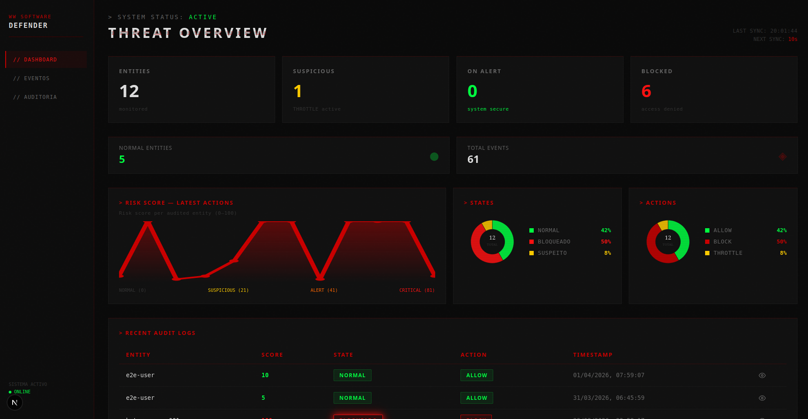
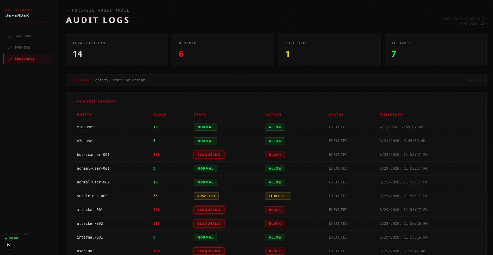

# WW Software Defender

**Intelligent Forensic Monitoring System**

WW Software Defender is a real-time security decision engine that analyses events, calculates behavioural risk, defines entity state, takes automatic decisions and executes defensive actions — fully auditable and traceable.

Instead of just logging alerts, the system **closes the full loop**: detect → evaluate → decide → act → audit, without constant human intervention.

> **Version:** v1.1.0 — Multi-Tenant Ready  
> **Production:** https://ww-software-defender-production.up.railway.app

---

## Screenshots


*Main dashboard with KPIs, risk timeline and real-time audit logs*


*Event stream with filter and auto-refresh every 30 seconds*


*Full forensic trail with complete decision traceability*


*Entity forensic view — event timeline, decision history, current state*

---

## Features

- **Full decision engine** — Event → Risk → State → Decision → Action → Audit
- **Automatic Risk Score** (0–100) with behavioural rules
- **Automatic entity states** — `NORMAL` | `SUSPEITO` | `ALERTA` | `CRÍTICO` | `BLOQUEADO`
- **Automatic defensive decisions** — `ALLOW` | `THROTTLE` | `CHALLENGE` | `BLOCK`
- **Dual authentication** — JWT + API Keys for external systems
- **Webhooks with retry** — notify external systems on BLOCK events
- **Rate limiting per entity** via Redis
- **Entity drill-down** — full forensic view per entity
- **Multi-tenancy foundation** — schema-based isolation per tenant
- **Real-time dashboard** — KPIs, risk timeline, pie charts, audit logs
- **Full audit trail** — complete traceability of all decisions
- **Professional CI/CD** — unit tests, E2E tests, GitHub Actions

---

## Tech Stack

| Layer | Technology |
|-------|------------|
| Monorepo | Turborepo + npm workspaces |
| Backend | NestJS + TypeORM + PostgreSQL |
| Cache / Rate Limiting | Redis + @keyv/redis |
| Auth | JWT + Passport + API Keys (passport-custom) |
| Frontend | Next.js 16 + Framer Motion |
| Infra local | Docker Compose |
| Infra production | Railway (API + PostgreSQL + Redis) |
| CI/CD | GitHub Actions |
| Quality | ESLint + Husky + Commitlint |
| Tests | 31 unit tests + 12 E2E tests |

<div align="center">


</div>

---

## Getting Started

### Prerequisites

- Git
- Node.js v22 (via NVM recommended)
- Docker and Docker Compose

### Installation

```bash
# 1. Clone the repository
git clone https://github.com/kelsonFilipeDev/ww-software-defender.git
cd ww-software-defender

# 2. Copy environment variables
cp apps/api/.env.example apps/api/.env

# 3. Start services (PostgreSQL + Redis)
docker compose -f infra/docker/docker-compose.yml up -d

# 4. Install dependencies
npm install

# 5. Run migrations
cd apps/api && npm run migration:run && cd ../..

# 6. Start in development mode
npm run dev
```

After starting:
- **Dashboard** → http://localhost:3000
- **API** → http://localhost:3001

---

## API Usage

### 1. Authenticate

```bash
curl -X POST http://localhost:3001/api/auth/token \
  -H "Content-Type: application/json" \
  -d '{
    "clientId": "default",
    "apiKey": "<your-api-key>"
  }'
```

Response:
```json
{
  "accessToken": "<jwt-token>"
}
```

### 2. Send an event

```bash
curl -X POST http://localhost:3001/api/events \
  -H "Authorization: Bearer <jwt-token>" \
  -H "Content-Type: application/json" \
  -d '{
    "type": "LoginFailed",
    "entityId": "user-123",
    "payload": { "ip": "192.168.1.100" }
  }'
```

### 3. Check risk, state and decision

```bash
# Risk score (0–100)
curl http://localhost:3001/api/risk/user-123 \
  -H "Authorization: Bearer <jwt-token>"

# Entity state
curl http://localhost:3001/api/state/user-123 \
  -H "Authorization: Bearer <jwt-token>"

# Decision
curl http://localhost:3001/api/decision/user-123 \
  -H "Authorization: Bearer <jwt-token>"
```

### 4. Execute action

```bash
curl -X POST http://localhost:3001/api/action/user-123 \
  -H "Authorization: Bearer <jwt-token>"
```

### 5. Audit trail

```bash
curl http://localhost:3001/api/audit/user-123 \
  -H "Authorization: Bearer <jwt-token>"
```

### Authentication via API Key (external systems)

```bash
curl -X POST http://localhost:3001/api/events \
  -H "x-api-key: <your-api-key>" \
  -H "Content-Type: application/json" \
  -d '{"type": "LoginFailed", "entityId": "user-123", "payload": {}}'
```

---

## Risk Model

| Event | Weight |
|-------|--------|
| LoginFailed | +5 |
| LoginFailedRepeat | +10 |
| SuspiciousIp | +20 |
| PasswordReset | +25 |

| Score | State | Action |
|-------|-------|--------|
| 0–20 | NORMAL | ALLOW |
| 21–40 | SUSPEITO | THROTTLE |
| 41–60 | ALERTA | CHALLENGE |
| 61–80 | CRÍTICO | BLOCK |
| 81–100 | BLOQUEADO | BLOCK |

---

## Architecture
ww-software-defender/
├── apps/
│   ├── api/                          → NestJS (core engine)
│   │   └── src/
│   │       ├── common/tenant-context/ → ALS + TenantMiddleware
│   │       ├── infrastructure/database/
│   │       ├── modules/
│   │       │   ├── auth/
│   │       │   ├── api-keys/
│   │       │   ├── tenants/
│   │       │   ├── event/
│   │       │   ├── risk/
│   │       │   ├── state/
│   │       │   ├── decision/
│   │       │   ├── action/
│   │       │   ├── audit/
│   │       │   └── webhooks/
│   │       └── shared/guards/
│   └── web/                          → Next.js (dashboard)
│       └── app/
│           ├── dashboard/
│           ├── events/
│           ├── audit/
│           └── entity/[id]/
├── docs/sprints/
├── infra/docker/
└── .github/workflows/

---

## Development

```bash
# Unit tests
cd apps/api && npm run test

# E2E tests
cd apps/api && npm run test:e2e

# Migrations
cd apps/api && npm run migration:run

# Lint
npm run lint
```

---

## Contributing

Contributions are welcome!

1. Fork the repository
2. Create a branch from `develop` using Conventional Commits (`feat/`, `fix/`, `docs/`)
3. Develop the feature or fix
4. Open a small, well-documented Pull Request

All contributions must follow Clean Code, KISS, and the project manifestos.

---

## License

This project is licensed under the **MIT License**.
You may use, modify and distribute freely, provided you keep the copyright notice.
See [LICENSE](LICENSE) for details.

---

## Contact

**Kelson Filipe**
GitHub: [@kelsonFilipeDev](https://github.com/kelsonFilipeDev)
Email: kelsonfilipedev@gmail.com
