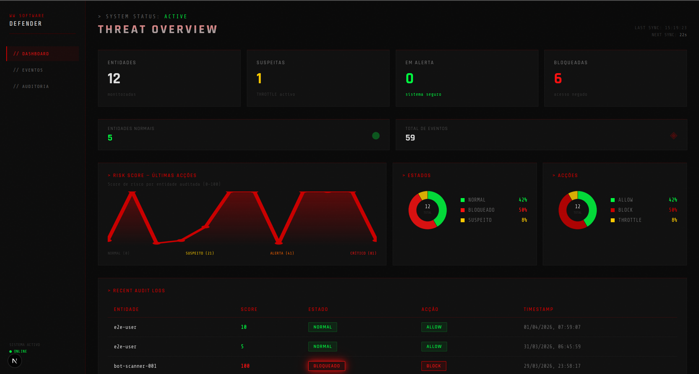
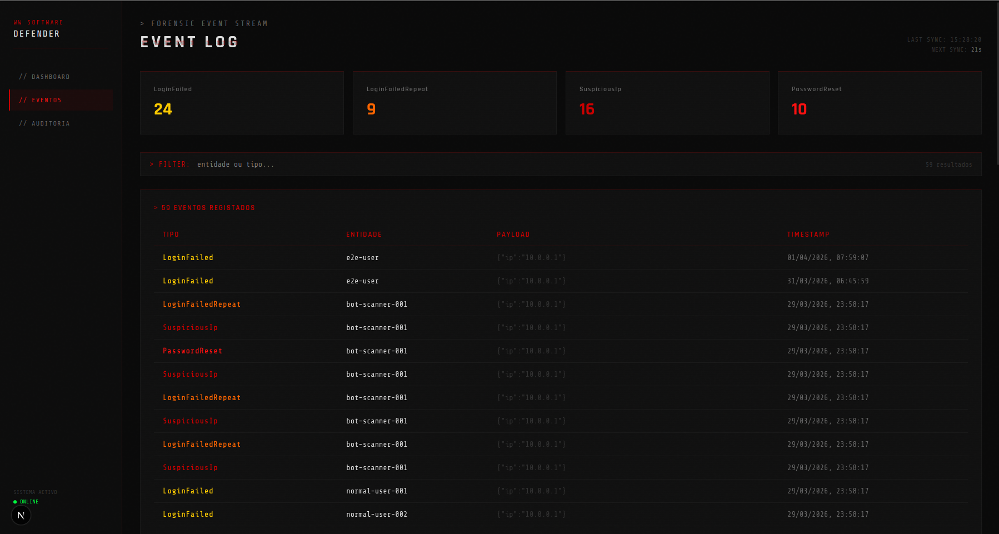
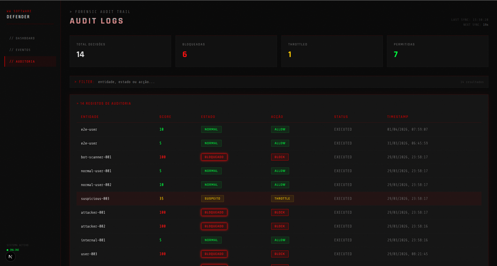

# WW Software Defender

**Sistema de Monitorização Forense Inteligente**

O WW Software Defender é um motor de decisão de segurança que analisa eventos em tempo real, calcula risco comportamental, define o estado da entidade, toma decisões automáticas e executa ações defensivas — tudo completamente auditável e rastreável.

Em vez de apenas registar alertas, o sistema **fecha o ciclo completo**: deteta → avalia → decide → age → audita, sem depender de intervenção humana constante.

## Recursos e Demonstração

### Funcionalidades principais

- Motor completo de decisão — Evento → Risco → Estado → Decisão → Ação
- Cálculo automático de Risk Score (0-100) com regras comportamentais
- Estados automáticos da entidade: `NORMAL` | `SUSPEITO` | `ALERTA` | `CRÍTICO` | `BLOQUEADO`
- Decisões defensivas automáticas: `ALLOW` | `THROTTLE` | `CHALLENGE` | `BLOCK`
- Execução imediata de ações com auditoria forense
- API REST totalmente autenticada com JWT
- Dashboard em tempo real com KPIs, timeline de risco, gráficos e logs
- Auditoria completa — rastreabilidade total de todas as decisões
- Pipeline CI/CD profissional com testes unitários e E2E

### Demonstração

  
*Dashboard principal com KPIs, timeline de risco e logs em tempo real*

  
*Stream de eventos com filtro e auto-refresh a cada 30 segundos*

  
*Trail forense completo com rastreabilidade total das decisões*

## Guia de Início Rápido (Getting Started)

### Pré-requisitos

- Git
- Node.js (v20 ou superior)
- Docker e Docker Compose
- PostgreSQL (via Docker)
- Redis (via Docker)

### Instalação

```bash
# 1. Clona o repositório
git clone https://github.com/kelsonFilipeDev/ww-software-defender.git
cd ww-software-defender

# 2. Copia as variáveis de ambiente
cp apps/api/.env.example apps/api/.env

# 3. Sobe os serviços (PostgreSQL + Redis)
docker compose -f infra/docker/docker-compose.yml up -d

# 4. Instala dependências
npm install

# 5. Inicia o projeto em modo desenvolvimento
npm run dev
```

### Como usar
Após iniciar o projeto:

Dashboard → acede a http://localhost:3000

API → disponível em http://localhost:3001

# Exemplo prático — Enviar um evento para o sistema:

```bash
curl -X POST http://localhost:3001/api/events \
  -H "Authorization: Bearer SEU_TOKEN_JWT" \
  -H "Content-Type: application/json" \
  -d '{
    "entityId": "user-123",
    "type": "LOGIN_FAILED",
    "ip": "192.168.1.100",
    "metadata": {
      "userAgent": "Mozilla/5.0"
    }
  }'
  ```
## Stack Tecnológica

- **Monorepo**: Turborepo + npm  
- **Backend**: NestJS + TypeORM + PostgreSQL  
- **Cache / Rate Limiting**: Redis + Keyv  
- **Auth**: JWT + Passport  
- **Frontend**: Next.js 16 + Framer Motion  
- **Infra**: Docker Compose  
- **CI/CD**: GitHub Actions  
- **Qualidade**: ESLint + Husky + Commitlint + 31 testes unitários + 12 testes E2E

<div align="center">


</div>

## Informações Complementares

### Contribuição

Contribuições são bem-vindas e incentivadas!

1. Faz fork do repositório
2. Cria uma branch com Conventional Commits (`feat/`, `fix/`, `docs/`, etc.)
3. Desenvolve a funcionalidade ou correção
4. Abre um Pull Request pequeno e bem documentado

Todas as contribuições devem seguir o padrão de Clean Code, KISS e os manifestos do projeto.

### Licença

Este projeto está licenciado sob a **MIT License**.  
Podes utilizar, modificar e distribuir livremente, desde que mantenhas o aviso de copyright.  
Ver o ficheiro [LICENSE](LICENSE) para mais detalhes.

### Contato

**Kelson Filipe**  
GitHub: [@kelsonFilipeDev](https://github.com/kelsonFilipeDev)  
Email: kelsonfilipedev@gmail.com
